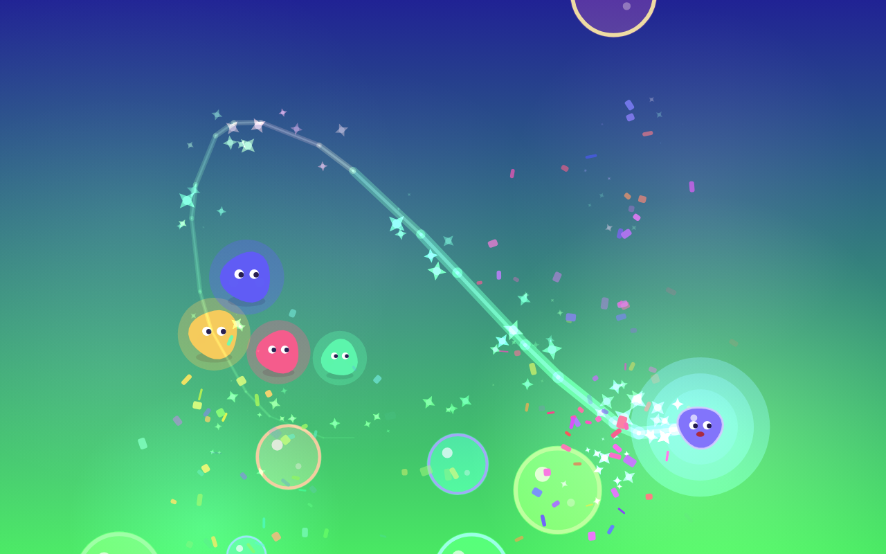

# ポインターであそぼう（play-the-pc）

初めて PC に触れる子ども（2 歳〜）のための、Mac 専用デスクトップアプリです。

**トラックパッドでポインターを適当に動かすだけで楽しい**ことだけを目的にしています。
文字は一切出しません。クリックもドラッグも要りません。目的も、失敗も、スコアもありません。



## あそびかた

指をトラックパッドの上で動かすだけです。

| すること | おきること |
| --- | --- |
| ポインターを動かす | 光る生き物になったポインターが、キラキラと虹色の線を引きながら付いてくる |
| 速く動かす | 生き物が進む方向に伸び、キラキラが増えて虹色になり、風の音がする |
| シャボン玉に重ねる | ぱちんと割れて紙吹雪が舞い、画面の高さに応じた音が鳴る |
| じっとしている | おともだちがそばに寄ってきて、うれしそうに跳ねる |
| しばらく動かさない | ポインターが「ここだよ」と輪を出して居場所を知らせる |

音は C メジャー・ペンタトニックに揃えてあるので、でたらめに遊んでも音が濁りません。
画面の上ほど高い音、下ほど低い音が鳴ります。

## 大人のかたへ

### 終了のしかた

**Esc キーを 2 秒間押しっぱなし**にしてください。右上に進むリングが出て、一周すると終了します。

子どもがキーボードを叩いても終了しないよう、意図的にこの形にしています。

### 子どもが触っても大丈夫なようにしていること

- 全画面固定。メニューもタイトルバーもボタンもありません
- `Cmd+Q` / `Cmd+W` / `Cmd+H` などのショートカットは無効
- Esc 以外のキーは何も起こしません（叩いても壊れません）
- 右クリックメニュー・文字選択・ドラッグ&ドロップ・ピンチ拡大はすべて無効
- 外部との通信を一切行いません（ネットワークをアプリ側で遮断しています）
- カメラ・マイク・位置情報などの権限要求はすべて拒否します
- 目への配慮：急な明滅や高コントラストの点滅を出しません
- 耳への配慮：音量に上限を設け、同時発音数と発音間隔を制限しています
- 動作が重い Mac では自動的に解像度を落とし、なめらかさを優先します

なお、`Cmd+Tab` や `Cmd+Option+Esc`（強制終了）といった macOS 本体のショートカットは、
アプリからは無効化できません。強制終了の窓を塞がないよう、ウィンドウの重なり順は
あえて最上位より一段低くしてあります。

## 動かす

Node.js 20 以上が必要です。

```bash
npm install
npm start
```

### Mac アプリとして書き出す

```bash
npm run dist
```

`release/` に `.dmg` ができます（Apple の署名・公証は行っていないため、
初回起動時は右クリック →「開く」で許可してください）。

> ビルドは macOS 上で実行してください。他の OS では .app を作れません。

## 開発

```bash
npm run typecheck   # 型チェック（メイン / レンダラー / テスト）
npm test            # 単体テスト（Vitest）
npm run test:e2e    # 実ブラウザでの描画テスト（Playwright、要 npx playwright install chromium）
npm run test:smoke  # Electron を起動して画面が動くか確認し、自動終了する
```

`npm run test:e2e` は `docs/screenshot.png` も更新します。
別の場所の Chromium を使いたい場合は `PLAYWRIGHT_CHROMIUM_EXECUTABLE` で指定できます。

### 構成

```
src/
  core/      遊びのロジック（DOM にも Electron にも依存しない・テスト対象）
    entities/  キャラクター、キラキラ、シャボン玉、紙吹雪、おともだち、軌跡
  renderer/  画面（キャンバスの用意、入力の配線、描画ループ）
  main/      Electron のメインプロセス（ウィンドウ、安全策、独自スキーム配信）
tests/
  unit/      core の単体テスト
  e2e/       実際に描画して操作する結合テスト
.claude/plans/  立案した計画
```

遊びのロジックはすべて `src/core/` に閉じ込め、`CanvasRenderingContext2D` を
引数で受け取る形にしています。そのため、ブラウザなしで描画処理まで検証できます。

技術スタックは Electron + TypeScript + Canvas 2D + WebAudio です。
バンドラは使わず、`tsc` が出力した ES モジュールをそのまま読み込みます。
音の素材ファイルはなく、すべて実行時に合成しています。

## これから

- キーボードを叩いて遊ぶ機能（今回のスコープ外）
- 保護者向けの設定（音量、遊べる時間）
